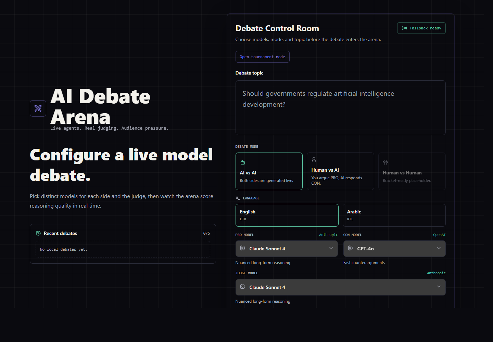
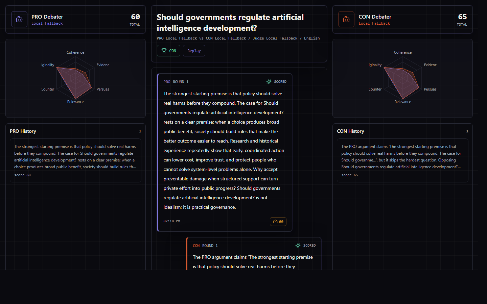
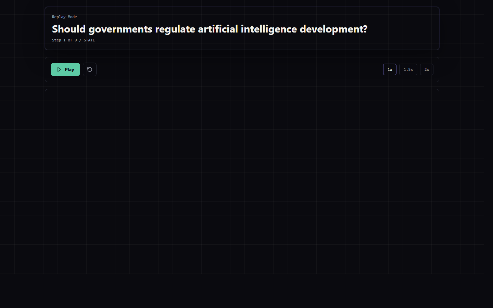
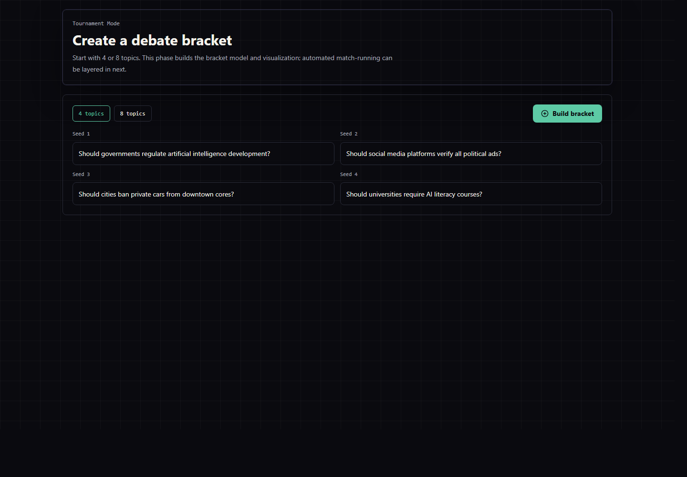
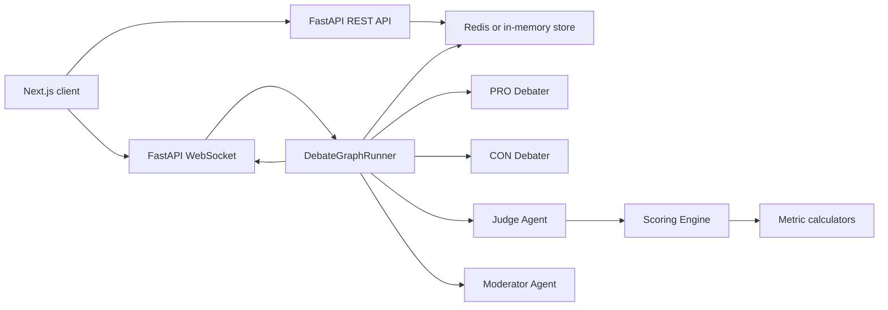

# AI Debate Arena


AI Debate Arena is a real-time AI debate platform where two debaters argue opposite sides of a topic while a judge agent scores argument quality live. The app supports AI vs AI, Human vs AI, Arabic debates with RTL layout, explainable judging, replay, analytics, and an early tournament bracket system.

The project is designed as a portfolio-grade full-stack AI systems product: typed backend models, strict TypeScript frontend, WebSocket updates, Redis-backed state, deterministic local fallback mode, and Docker-based startup.

## Demo

Demo video: YouTube walkthrough coming soon.

Recommended video flow:

1. Create an AI vs AI debate with different PRO, CON, and Judge models.
2. Show live arguments, judging state, radar updates, and audience voting.
3. Open the explainability panel for one scored argument.
4. Run a Human vs AI debate and submit a manual argument.
5. Switch to Arabic and show RTL argument rendering.
6. Open replay mode and tournament mode.

## Screenshots

### Debate Setup



### Live Debate Arena



### Replay Mode



### Tournament Bracket



## Features

- Real-time AI debates over WebSockets.
- Independent model selection for PRO, CON, and Judge.
- AI vs AI and Human vs AI modes.
- Human vs Human placeholder for future multiplayer support.
- English and Arabic debate support.
- RTL UI rendering for Arabic debates.
- Judge explainability panel for every scored argument.
- Six-dimension scoring engine with weighted final score.
- Conservative toxicity and unsafe rhetoric flagging.
- Audience voting with live totals.
- Debate replay with step-by-step playback and speed controls.
- End-of-debate analytics dashboard.
- Tournament bracket data model and bracket visualization.
- Redis state persistence with in-memory fallback for local demos.
- Docker Compose startup for backend, frontend, and Redis.
- Local fallback agents and scoring when API keys are unavailable.

## Architecture



The backend owns debate orchestration and scoring. The frontend renders setup, live debate state, replay, analytics, and tournament views. Redis stores active debate and tournament state; if Redis is unavailable, the backend falls back to process-local memory so demos still work.

## Tech Stack

| Layer | Technology |
| --- | --- |
| Frontend | Next.js 14 App Router, React, TypeScript strict mode |
| Styling | Tailwind CSS |
| State | Zustand |
| Charts | Recharts |
| API Client | Axios |
| Backend | FastAPI, Pydantic v2, Python type hints |
| Agent Flow | LangGraph-compatible debate runner |
| Realtime | Native FastAPI WebSockets |
| State Store | Redis with in-memory fallback |
| LLM Providers | Anthropic Claude Sonnet 4 primary, OpenAI GPT-4o optional judge |
| Analysis | spaCy, sentence-transformers, custom scoring logic |
| Infrastructure | Docker, Docker Compose |

## Product Design

The redesign was planned in Figma before implementation:

- Figma file: [AI Debate Arena Premium Redesign](https://www.figma.com/design/E1AqzqML9q0xkAnAhIfxqO)
- Scope: setup screen, AI vs AI arena, Human vs AI composer, Arabic RTL arena, explainability panel, analytics dashboard, replay flow, and tournament bracket preview.
- Direction: dark futuristic debate arena, strong hierarchy, dashboard-grade density, minimal visual noise, and recruiter-ready polish.

## Repository Structure

```text
ai-debate-arena/
|-- backend/
|   |-- main.py
|   |-- agents/
|   |-- api/
|   |-- graph/
|   |-- safety/
|   |-- scoring/
|   |-- tournament/
|   |-- config.py
|   `-- requirements.txt
|-- data/
|   `-- ibm_argument_quality_ranking_30k/
|-- docs/
|   `-- screenshots/
|-- frontend/
|   |-- src/
|   |   |-- app/
|   |   |-- components/
|   |   |-- hooks/
|   |   |-- lib/
|   |   `-- styles/
|   |-- package.json
|   `-- tsconfig.json
|-- docker-compose.yml
|-- .env.example
`-- README.md
```

## Backend Overview

- `backend/main.py` creates the FastAPI app, configures CORS, registers REST and WebSocket routers, and exposes `/health`.
- `backend/config.py` centralizes environment variables, model defaults, Redis URL, timeout settings, CORS origins, and fallback behavior.
- `backend/agents/debater.py` contains PRO and CON debater classes, prompt templates, word-limit handling, API-backed generation, and local fallback generation.
- `backend/agents/judge.py` contains the judge agent, structured JSON judge prompt, retry handling for malformed JSON, and fallback scoring integration.
- `backend/agents/moderator.py` checks turn flow, topic adherence, continuation rules, and final summary generation.
- `backend/scoring/models.py` defines typed Pydantic models such as `Argument`, `ArgumentScore`, `DebateState`, and `DebateConfig`.
- `backend/scoring/metrics.py` implements the six metric calculators: coherence, evidence, persuasiveness, relevance, counterargument strength, and originality.
- `backend/scoring/engine.py` aggregates metric scores with the configured weights and attaches reasoning, strongest point, weakest point, explanations, and flags.
- `backend/safety/toxicity.py` performs conservative toxicity checks for insults, hate speech, personal attacks, aggressive language, and off-topic attacks.
- `backend/graph/debate_graph.py` runs debate state transitions and orchestrates debaters, judge, moderator, and WebSocket broadcasts.
- `backend/api/debate.py` exposes debate creation, start, state, vote, score, and human argument endpoints.
- `backend/api/ws.py` manages WebSocket connections and pushes state, argument, score, end, and error events.
- `backend/api/tournament.py` exposes tournament creation and retrieval endpoints.
- `backend/tournament/models.py` and `backend/tournament/engine.py` define tournament bracket state and bracket creation logic.

## Frontend Overview

- `frontend/src/app/page.tsx` renders the home setup screen with topic input, model selectors, mode selection, language selection, and recent debates.
- `frontend/src/app/debate/[id]/page.tsx` renders the live debate route.
- `frontend/src/app/replay/[id]/page.tsx` renders debate replay mode.
- `frontend/src/app/tournament/page.tsx` renders tournament setup and bracket visualization.
- `frontend/src/components/DebateArena.tsx` is the main live arena container for side panels, argument feed, status, voting, analytics, and explainability.
- `frontend/src/components/ArgumentCard.tsx` renders argument bubbles, scoring badges, warning flags, and streaming-style visual states.
- `frontend/src/components/ScoreRadar.tsx` renders the six-axis Recharts radar chart.
- `frontend/src/components/VotePanel.tsx` handles audience votes.
- `frontend/src/components/StatusBar.tsx` shows debate state, rounds, and score comparison.
- `frontend/src/components/JudgeExplainabilityPanel.tsx` explains why each argument earned or lost points.
- `frontend/src/components/DebateAnalytics.tsx` renders post-debate score trends and best/weakest argument insights.
- `frontend/src/components/DebateReplay.tsx` reconstructs saved debate history into replay events.
- `frontend/src/components/TournamentBracket.tsx` renders the bracket visualization.
- `frontend/src/hooks/useDebateSocket.ts` manages native WebSocket connection and reconnect behavior.
- `frontend/src/hooks/useDebateStore.ts` stores live debate state with Zustand.
- `frontend/src/lib/api.ts` contains the typed Axios REST client and WebSocket URL helper.
- `frontend/src/lib/types.ts` contains shared TypeScript interfaces and constants.
- `frontend/src/styles/globals.css` defines the dark arena theme, Tailwind layers, scrollbars, and animation utilities.

## Agent System

The debate uses four agent roles:

- PRO Debater argues in favor of the topic, references previous PRO arguments, and counters the latest CON argument.
- CON Debater argues against the topic, references previous CON arguments, and counters the latest PRO argument.
- Judge scores every submitted argument across six dimensions and returns structured JSON.
- Moderator enforces turn order, checks topic adherence, decides continuation, and generates final summaries.

When API keys are configured, the backend can call Anthropic and OpenAI models. Without API keys, local fallback agents generate deterministic debate content so the product can be demoed immediately.

## Scoring Engine

Every argument receives dimension scores from `0.0` to `1.0`:

| Dimension | Implementation |
| --- | --- |
| Logical coherence | Premise-to-claim support approximation with circularity and contradiction penalties |
| Evidence quality | Regex-based detection of citations, statistics, expert references, anecdotes, years, and sources |
| Persuasiveness | Structured scoring path with local fallback |
| Relevance | Semantic similarity between topic and argument |
| Counterargument strength | Similarity against the previous opponent argument |
| Originality | Similarity against the same debater's prior arguments |

Final score weights:

```python
WEIGHTS = {
    "logical_coherence": 0.25,
    "evidence_quality": 0.20,
    "persuasiveness": 0.20,
    "relevance": 0.15,
    "counterargument": 0.15,
    "originality": 0.05,
}
```

The output is an `ArgumentScore` with dimension scores, final score, judge reasoning, explainability fields, timestamp, and flags.

## REST API

| Method | Endpoint | Purpose |
| --- | --- | --- |
| `POST` | `/api/debate/create` | Create a debate with topic, rounds, models, mode, and language |
| `POST` | `/api/debate/{debate_id}/start` | Start an AI vs AI debate |
| `GET` | `/api/debate/{debate_id}/state` | Retrieve full debate state |
| `POST` | `/api/debate/{debate_id}/argument` | Submit a human argument in Human vs AI mode |
| `POST` | `/api/debate/{debate_id}/vote` | Vote for PRO or CON |
| `GET` | `/api/debate/{debate_id}/scores` | Retrieve aggregate scoring data |
| `POST` | `/api/tournament/create` | Create a 4-topic or 8-topic bracket |
| `GET` | `/api/tournament/{tournament_id}` | Retrieve tournament state |

## WebSocket Flow

Clients connect to:

```text
ws://localhost:8000/ws/debate/{debate_id}
```

Server message types:

- `STATE_CHANGE`: debate state, current turn, and round changed.
- `ARGUMENT`: a new PRO, CON, or human argument was submitted.
- `SCORE_UPDATE`: judge score is ready for an argument.
- `DEBATE_ENDED`: winner, final scores, summary, and audience votes.
- `ERROR`: recoverable server-side issue.

On reconnect, the frontend fetches full state through REST and continues from the latest saved debate state.

## Human vs AI Mode

In Human vs AI mode, the human argues as PRO and the AI responds as CON. The arena only shows the manual input composer when it is the human's turn. Submitted human arguments are scored by the same judge and scoring engine as AI arguments, then streamed to connected clients before the AI response is generated.

## Arabic Debate Support

Arabic mode changes both backend behavior and frontend rendering:

- Debater prompts request Arabic arguments.
- Judge and moderator prompts evaluate Arabic text while keeping JSON keys in English.
- Local fallback mode can generate Arabic arguments.
- The debate arena switches to `dir="rtl"`.
- Argument cards use right-aligned Arabic-friendly layout and readable spacing.

## Explainability System

Each scored argument includes a learning-focused explainability view:

- final weighted score
- six dimension scores
- judge reasoning
- detected flags
- strongest point
- weakest point
- why the argument gained or lost points

This makes the product useful for understanding argument quality rather than only watching a score.

## Replay System

Replay mode is available at:

```text
/replay/{debate_id}
```

It rebuilds debate history from saved state and plays it as a sequence:

1. turn state
2. argument appears
3. judging state appears
4. score appears
5. next turn continues

Speed controls support `1x`, `1.5x`, and `2x`.

## Tournament Mode

Tournament mode is available at:

```text
/tournament
```

The current implementation includes:

- 4-topic and 8-topic bracket creation.
- Typed tournament models.
- Backend tournament endpoints.
- Frontend bracket visualization with pending advancement slots.

Automated match execution and bracket advancement are planned as the next tournament upgrade.

## Dataset

The project includes IBM Research's `argument_quality_ranking_30k` dataset under:

```text
data/ibm_argument_quality_ranking_30k/
```

Included files:

- `train.csv`
- `dev.csv`
- `test.csv`
- `README.md`
- `DATASET_SOURCE.md`

Source: [IBM Research argument_quality_ranking_30k on Hugging Face](https://huggingface.co/datasets/ibm-research/argument_quality_ranking_30k)

The dataset contains crowd-sourced arguments for debate topics with stance and quality annotations. It is included for future calibration, evaluation, and demo analytics work.

## Quick Start

### Option 1: Docker

```bash
cp .env.example .env
docker compose up --build
```

Open:

```text
http://localhost:3000
```

### Option 2: Local Development

Backend:

```bash
cd backend
python -m venv .venv
.venv\Scripts\activate
pip install -r requirements.txt
python -m uvicorn main:app --reload
```

Frontend:

```bash
cd frontend
npm install
npm run dev
```

Environment variables live in `.env`. The `.env.example` file documents all required settings. The application works without API keys through local fallback mode.

## Verification

Commands used for the final project check:

```bash
python -m py_compile backend\main.py backend\api\debate.py backend\api\ws.py backend\api\tournament.py backend\agents\debater.py backend\agents\judge.py backend\agents\moderator.py backend\graph\debate_graph.py backend\scoring\engine.py backend\scoring\metrics.py backend\scoring\models.py backend\safety\toxicity.py backend\tournament\engine.py backend\tournament\models.py
cd frontend
npm run lint
npm run typecheck
npm run build
```

Security and repository hygiene checks:

```bash
git ls-files | Select-String -Pattern '\.env$'
git ls-files | Select-String -Pattern 'node_modules|\.next|logs|__pycache__|\.pytest_cache'
git ls-files | ForEach-Object { Select-String -Path $_ -Pattern 'sk-[A-Za-z0-9_-]{20,}|sk-ant-[A-Za-z0-9_-]+|ghp_[A-Za-z0-9_]+|github_pat_[A-Za-z0-9_]+|AIza[0-9A-Za-z_-]{20,}|-----BEGIN (RSA |OPENSSH |EC |)PRIVATE KEY-----' -ErrorAction SilentlyContinue }
```

## Current Limitations

- Live provider calls require valid Anthropic and/or OpenAI API keys.
- The included NLI and embedding logic has lightweight local fallbacks for demo speed and reliability.
- Tournament mode currently creates and visualizes brackets but does not automatically run every bracket match.
- Human vs Human is intentionally a disabled placeholder.
- Replay reconstructs events from saved state rather than recording raw WebSocket timing.
- Screenshots are static; the YouTube walkthrough will show the full interactive experience.

## Future Work

- Add automated tournament match execution and bracket advancement.
- Add authenticated user accounts and saved debate libraries.
- Add calibrated evaluation against the included IBM argument quality dataset.
- Add richer streaming from provider APIs when live keys are present.
- Add exportable debate reports for recruiters, classrooms, or coaching.
- Add CI checks for backend imports, frontend linting, type checking, and production build.
- Add hosted deployment with persistent Redis and environment-based provider configuration.
