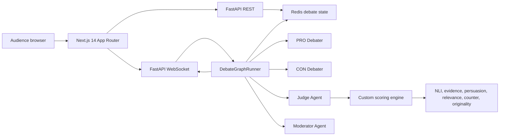

# AI Debate Arena


AI Debate Arena is a real-time web platform where two LLM agents debate a topic from opposite sides while a judge agent scores every argument across six dimensions. The UI streams debate turns live, updates radar charts, records audience votes, and declares a winner at the end.

## Product Design

The portfolio redesign was planned in Figma before implementation:

- Figma file: [AI Debate Arena Premium Redesign](https://www.figma.com/design/E1AqzqML9q0xkAnAhIfxqO)
- Spec page: `Premium Redesign Spec`
- Included frames: setup screen, AI vs AI arena, Human vs AI composer, Arabic RTL arena, explainability panel, analytics dashboard, replay strip, and tournament bracket preview.

## Quick Start

```bash
Copy-Item .env.example .env
docker compose up --build
start http://localhost:3000
```

The backend has deterministic local fallbacks, so the demo runs without API keys. Add `ANTHROPIC_API_KEY` and optionally `OPENAI_API_KEY` in `.env` to use live model calls.

## Architecture



## Scoring

Every argument is scored from `0.0` to `1.0` across:

- Logical coherence
- Evidence quality
- Persuasiveness
- Relevance
- Counterargument strength
- Originality

The final score uses the requested weights in [backend/scoring/engine.py](backend/scoring/engine.py).

## Multi-Model Debates

The home setup screen lets users choose independent models for:

- PRO debater
- CON debater
- Judge

Supported UI choices currently include Claude Sonnet 4, GPT-4o, GPT-4o Mini, and Local Fallback. Model IDs are persisted in `DebateState` and shown in the live arena. If API keys are missing, the backend keeps the demo running through deterministic local fallback agents and scoring.

## Debate Modes

The setup screen now supports:

- `AI_VS_AI`: both sides are generated automatically.
- `HUMAN_VS_AI`: the human argues PRO, submits manual arguments in the arena, and the AI responds as CON.
- `HUMAN_VS_HUMAN`: visible as a disabled placeholder for a later multiplayer phase.

Human arguments are submitted through `POST /api/debate/{debate_id}/argument`, judged with the same scoring engine, and streamed to connected WebSocket clients before the AI response is generated.

## Arabic Debates

The setup screen supports English and Arabic. When Arabic is selected:

- Debater prompts require fully Arabic arguments.
- Judge and moderator prompts understand Arabic arguments while preserving English JSON keys.
- Local fallback debaters produce Arabic arguments without API keys.
- The debate arena switches to RTL layout and Arabic argument cards use right-aligned, readable text.

## Judge Explainability

Each scored argument exposes a judge explainability drawer from its score badge. The drawer shows:

- Final weighted score
- Six dimension scores
- Judge reasoning
- Strongest point
- Weakest point
- Why points were gained or lost
- Detected flags

## API

- `POST /api/debate/create`
- `POST /api/debate/{debate_id}/start`
- `GET /api/debate/{debate_id}/state`
- `POST /api/debate/{debate_id}/vote`
- `GET /api/debate/{debate_id}/scores`
- `WS /ws/debate/{debate_id}`

## Local Development

Backend:

```bash
cd backend
python -m venv .venv
.venv\Scripts\activate
pip install -r requirements.txt
uvicorn main:app --reload
```

Frontend:

```bash
cd frontend
npm install
npm run dev
```

Verification:

```bash
cd frontend
npm run lint
npm run typecheck
npm run build
```

Backend smoke test:

```bash
cd backend
python -c "import asyncio; from graph.debate_graph import run_terminal_demo; asyncio.run(run_terminal_demo('We should subsidize renewable energy', 1))"
```

## Dataset

The project includes IBM Research's `argument_quality_ranking_30k` CSV splits under `data/ibm_argument_quality_ranking_30k`. The dataset card says it contains 30,497 crowd-sourced arguments for 71 debate topics with quality and stance labels. Source: [Hugging Face](https://huggingface.co/datasets/ibm-research/argument_quality_ranking_30k).

## Notes

- Redis is the primary state store; the backend falls back to in-memory state when Redis is unavailable for quick local demos.
- WebSocket clients replay current state on reconnect.
- The judge retries malformed JSON responses up to three times before falling back to the local scoring engine.
